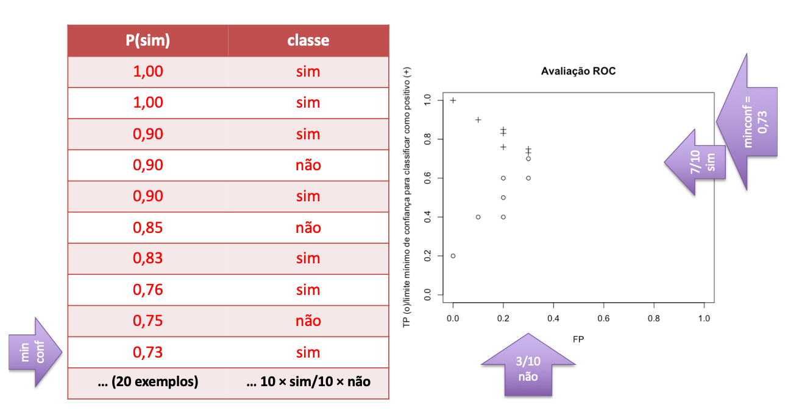

# 3 - Algorithms

Os algoritmos de Machine Learning podem ter vários comportamentos, de entre os quais:

`LD` - Vector de D dimensões que separa os dados em duas classes. Linear Regression;  
`DT` - Subdivisão dos dados de forma geométrica, em várias classes. Decision Treee;

## Classifiers

### Linear Regression Model

A variação depende do grau de correlação. Os resultados da avaliação deste modelo mostram que é bastante robusto.

### Linear Evaluation

- A estimativa de um valor Y dado X é sofre de um pequeno erro, já que é a linha que melhor define o conjunto de pontos;
- O erro médio não deve ser usado, porque depende do sinal;
- O erro absoluto médio pode ser usado;
- O erro absoluto quadrado dá mais importância a erros maiores mas como desvantagem pode ser dominado por eles;
- Os valores que dependem da escala da variável a encontrar podem ser determinantes para avaliar empiricamente se o resultado faz sentido;

### Decision Tree

Um método simples de classificação, binária ou não. Existe subdivisão de valores segundo atributos variados. As principais dificuldades são:
- Que atributos escolher para fazer a divisão?
- Quando parar a divisão, para que a classificação não faça **overfitting**?

### Simple Linear

Método `LD` que julga duas classes estarem separadas por uma única linha. É simples de configurar e interpretar, mas não é possível usá-lo em dados qualitativos e é sensível a outliers.

### Nearest Neighbors

Dado um objecto, este partilha a classe com o valor vizinho mais próximo. O algoritmo `KNN` é uma generalização deste, com K sendo normalmente um número ímpar, em que se escolhe a classe da maioria dos K vizinhos mais próximos.  
No entanto este algoritmo é sensível a atributos irrelevantes e sensível também a classificações efetuadas apenas tendo em conta um subset de features. Além disso, apesar de ser simples de implementar, é difícil de interpretar e é um classificador lento para grandes volumes de dados.

### Decisison Tree

É um método simples de implementar mas é fácil de ocorrer `overfitting` e difícil de escolher os atributos que fazem a divergência de classes. É robusto a anomalias nos dados (outliers, missing values, correlated attributes, irrelevant attributes, scale).

### Naive Bayes

P (c | d) = [P (d | c) * P(c)] / P (d)

> P (c | d) - Probabilidade de d estar na classe c  
> P (d | c) - Probabilidade de gerar a instância d dado a classe c  
> P (c) - Probabilidade de ocorrência da classe c  
> P (d) - Probabilidade de ocorrência da instância d  

É robusta a variáveis irrelevantes, rápido a treinar e implementar. Por outro lado assume indendência entre features e não é aplicável a features numéricas.

### Neural Networks

É universal, versátil, online, robusta, rápida quando já se tem o modelo treinado e pode ser produzida em paralelo. Por outro lado é lenta em fase de treino, difícil de interpretar e pouca adaptativa a novas realidades.

### Support Vector Machines (SVM)

Quanto **maior é a margem**, menos risco de overfitting do modelo. Pelo lado positivo, estes métodos são muito maturados, os resultados são independentes das condições iniciais e do número de atributos a testar, e dá para encontrar a *local minima*. Pode-se usar `funções não-lineares` se der para discriminar.

## Avaliação

- Através de `matrizes de confusão`, que apresenta os (falsos|verdadeiros) (positivos|negativos). Há algumas fórmulas a saber:

- `Curva ROC` (*Receiver Operating Characteristic*), para visualização da proporção de true positives por false positives.

