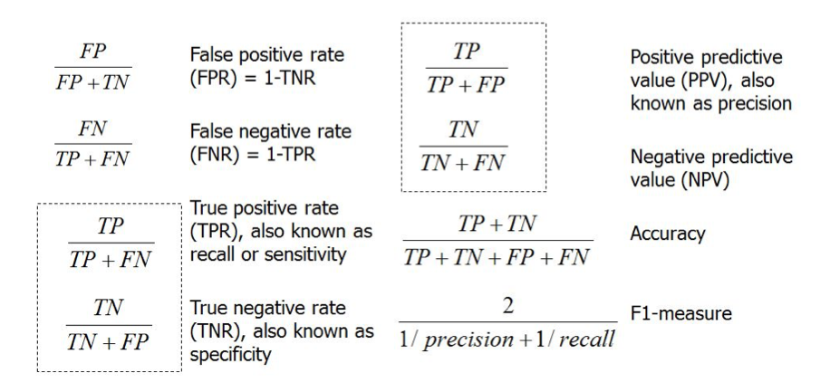

# Class Imbalance

Os modelos de Machine Learning estão preparados para minimizar os Falsos Positivos e os Falsos Negativos, e quando os dados de treino possuem uma grande disparidade entre classes positivas e negativas, o modelo poderá escolher tudo de uma só classe. De facto, não prevê nada e poderá colocar em causa o estudo em si.

Por isso, a classe de interesse deve ser sempre:
- a que não é positiva, dado o contexto;
- a que é menos frequente;

Além disso