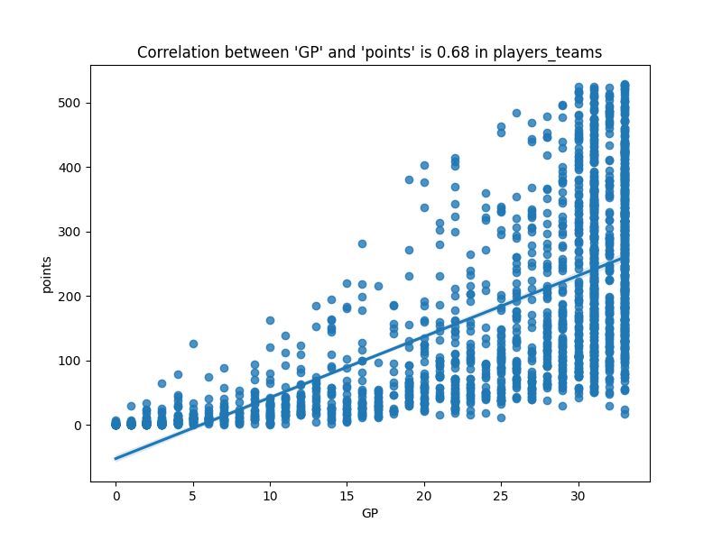
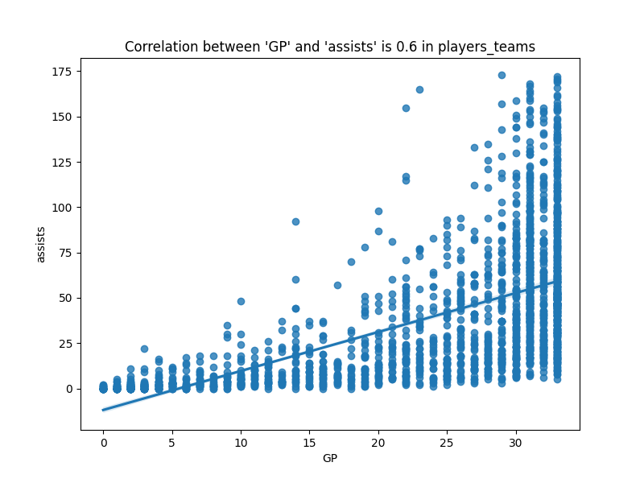
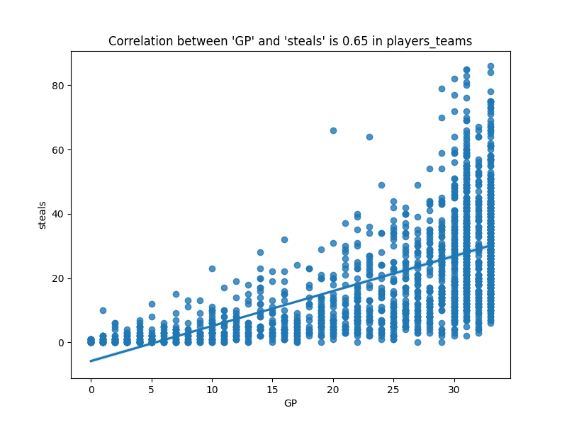
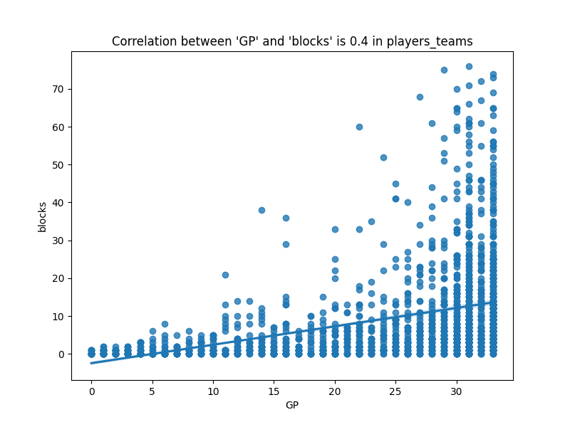
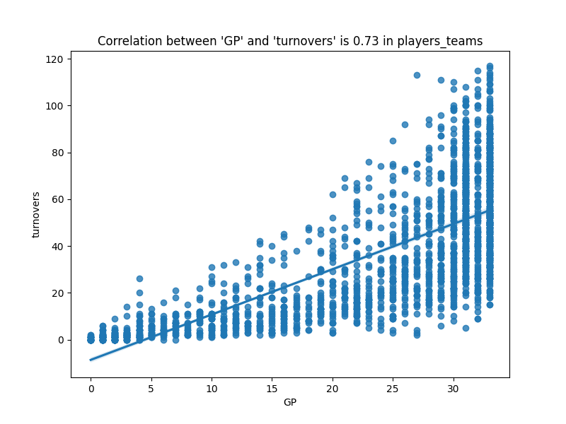
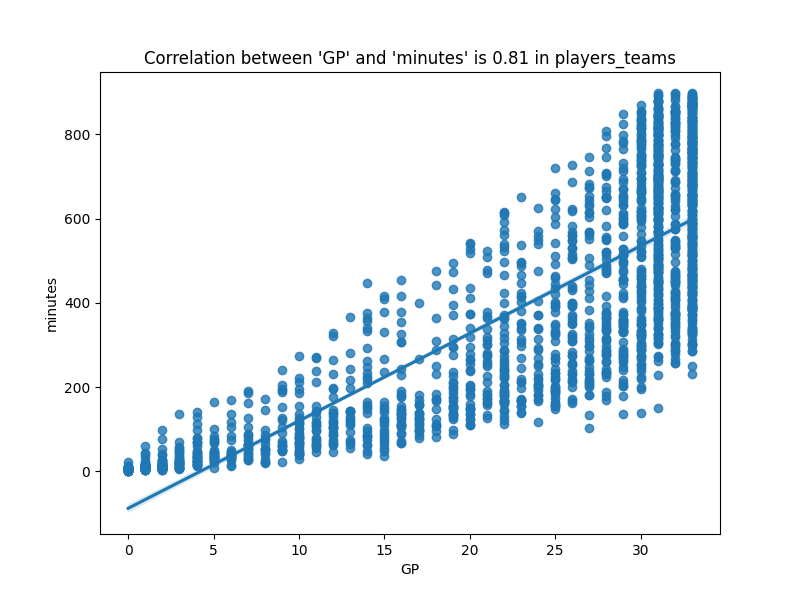
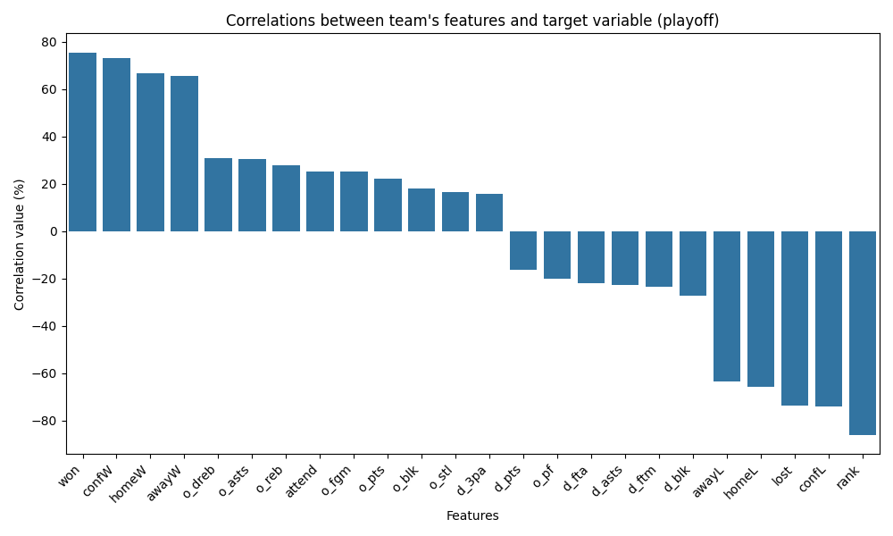

# Data Analysis

## Find same valued cols:

- `awards_players`: lgID
- `coaches`: lgID
- `players_teams`: lgID
- `players`: firstseason, lastseason
- `series_post`: lgIDWinner, lgIDLoser
- `teams_post`: lgID
- `teams`: lgID, seeded, tmORB, tmDRB, tmTRB, opptmORB, opptmDRB, opptmTRB

## Find some correlations between features
### Min correlation = 0.9

#### Dataset: players_teams

- `minutes`:`points` = 0.93
- `minutes`:`turnovers` = 0.92
- `minutes`:`fgAttempted` = 0.93
- `minutes`:`fgMade` = 0.91
- `points`:`fgAttempted` = 0.99
- `points`:`fgMade` = 0.99
- `points`:`ftAttempted` = 0.9
- `points`:`ftMade` = 0.92
- `oRebounds`:`rebounds` = 0.93
- `dRebounds`:`rebounds` = 0.99
- `fgAttempted`:`fgMade` = 0.99
- `ftAttempted`:`ftMade` = 0.99
- `threeAttempted`:`threeMade` = 0.98
- `PostMinutes`:`PostPoints` = 0.94
- `PostMinutes`:`PostdRebounds` = 0.91
- `PostMinutes`:`PostRebounds` = 0.91
- `PostMinutes`:`PostTurnovers` = 0.91
- `PostMinutes`:`PostPF` = 0.93
- `PostMinutes`:`PostfgAttempted` = 0.96
- `PostMinutes`:`PostfgMade` = 0.93
- `PostPoints`:`PostdRebounds` = 0.9
- `PostPoints`:`PostRebounds` = 0.9
- `PostPoints`:`PostfgAttempted` = 0.99
- `PostPoints`:`PostfgMade` = 0.99
- `PostPoints`:`PostftAttempted` = 0.91
- `PostPoints`:`PostftMade` = 0.91
- `PostoRebounds`:`PostRebounds` = 0.93
- `PostdRebounds`:`PostRebounds` = 0.99
- `PostdRebounds`:`PostPF` = 0.9
- `PostdRebounds`:`PostfgAttempted` = 0.91
- `PostdRebounds`:`PostfgMade` = 0.9
- `PostRebounds`:`PostPF` = 0.9
- `PostRebounds`:`PostfgAttempted` = 0.91
- `PostRebounds`:`PostfgMade` = 0.9
- `PostTurnovers`:`PostfgAttempted` = 0.9
- `PostfgAttempted`:`PostfgMade` = 0.98
- `PostftAttempted`:`PostftMade` = 0.99
- `PostthreeAttempted`:`PostthreeMade` = 0.96

#### Dataset: teams

- `tmID`:`franchID` = 0.97
- `tmID`:`name` = 1.0
- `franchID`:`name` = 0.97
- `rank`:`won` = -0.9
- `o_fgm`:`o_fga` = 0.9
- `o_fgm`:`o_pts` = 0.96
- `o_ftm`:`o_fta` = 0.94
- `o_3pm`:`o_3pa` = 0.96
- `o_dreb`:`o_reb` = 0.92
- `d_fgm`:`d_pts` = 0.96
- `d_ftm`:`d_fta` = 0.97
- `d_3pm`:`d_3pa` = 0.92
- `d_dreb`:`d_reb` = 0.95
- `won`:`lost` = -0.98
- `lost`:`confL` = 0.9
- `homeW`:`homeL` = -0.99
- `awayW`:`awayL` = -0.98
- `confW`:`confL` = -0.94

#### Correlation between 'GP' and 'points' - players_teams dataset

#### Correlation between 'GP' and 'assists' - players_teams dataset

#### Correlation between 'GP' and 'steals' - players_teams dataset

#### Correlation between 'GP' and 'blocks' - players_teams dataset

#### Correlation between 'GP' and 'turnovers' - players_teams dataset

#### Correlation between 'GP' and 'minutes' - players_teams dataset

#### Correlation between 'pos' and 'points' - (players_join_players_team) dataset

_pos_points_correlation.png)

#### Correlation between 'pos' and 'assists' - (players_join_players_team) dataset

_pos_assists_correlation.png)

#### Correlation between 'pos' and 'steals' - (players_join_players_team) dataset

_pos_steals_correlation.png)

#### Correlation between 'pos' and 'blocks' - (players_join_players_team) dataset

_pos_blocks_correlation.png)

#### Correlation between 'pos' and 'turnovers' - (players_join_players_team) dataset

_pos_turnovers_correlation.png)

### Correlations between team's features and target variable (playoff)

