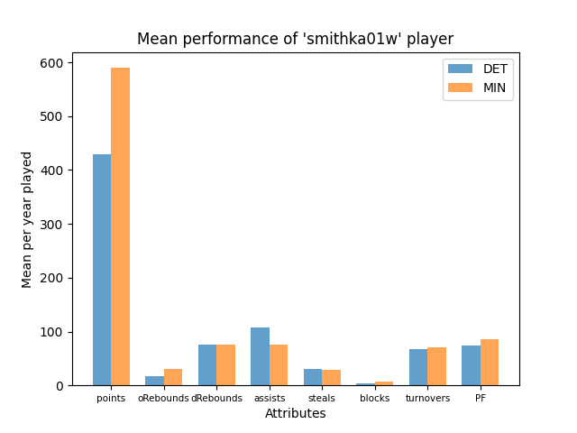

# Feature Engineering

## Awards Players

For the awards players we decided to create a new attribute called 'nrAwards' that represents how many awards did the player won that year and then we joined awards_players with player_teams to add this information.

As the awards_players.csv also contains the awards of the coaches we did a join with coaches to add the same information.

## Players

Through some analisys we discovered irrelevance in most of the columns of the players.csv. We decided to keep only the identifier of the player that we renamed it to 'playerID' and its 'pos'. 

The 'pos' attribute was used for analisys. We thought that depending the player position its stats would vary significantly but with some analisys we concluded the opposite.

## Coaches:

For each coach were calculated his/her season_win_rate, overall win_rate (its win_rate of every season until that year - represents his experience) and post_win_rate - represents post season experience. We also added the nrAwards of a coach per year, that would be usefull for 

## Players_Teams:

For this csv file we did the following approach:
- Keep all important stats of season and post_season of each player that would be important for building a ``mean_player_stats`` of each team that is explained in [data_preparation](./data_preparation.md). We kept also the nrAwards of each player per year and with the attributes goals_made and goals_attempted we calculated an accuracy and post_accuracy for each player.

## Teams:

#### For this csv file we did the following assumption:
- Team attributes are the sum of all the team's players stats of a season.
- Every year, the team's players change. So on every pre-season we have new players that werent on the team the season before. 
- If we are building datasets for each year with the information of the season before, for the information of the pre-season:
    - It's more relevant to have all the players (that forms the team of this new season) info of the last season, than the team's info of the last season, because it could be about others players.
- Then we aggregate the rest of the team information.
    - matches and win_rate, nrChampionships, post_matches and post_win_rate and last_season_wins and last_season_losses.

#### After the first results of our model we went back for feature Engeneering and did the following analysis:
- For the best teams, with most championships, we looked for: 
    - players that received awards (prestiged players) that only joined the team for some years.
    - We concluded that the player statistics changed quite a bit:  
    
    - Although the fact that the DET team is much better than the MIN team, this player had a better performance on MIN, due to the fact that DET team has more outstanding players and the statistics are more distributed.
    - As this, we decided to add teams statistics, that included the offensive stats and the deffensive stats and we changed them for the mean per game as are presented on the NBA oficial stats page.

The 'confID' is valuable for the playoff decision. Just 4 players of each Conference go to the playoffs phase. 
The 'rank' attribute was dropped because we used a different approach.

## Series_Post:

This file represent the post season performance of each team. It helped us to conclude some relevant information:
- like how many games every round takes
- fill some missing values that teams.csv had
But overall, for the finals datasets we did not use any information from this file.

## Teams_Post:

This file gives us the information of the series_post in a more consolidated way. It shows us the performance of each team on the post season on every year. Aggregated with the column 'finals' of the teams.csv we get all the information needed of the post_season.